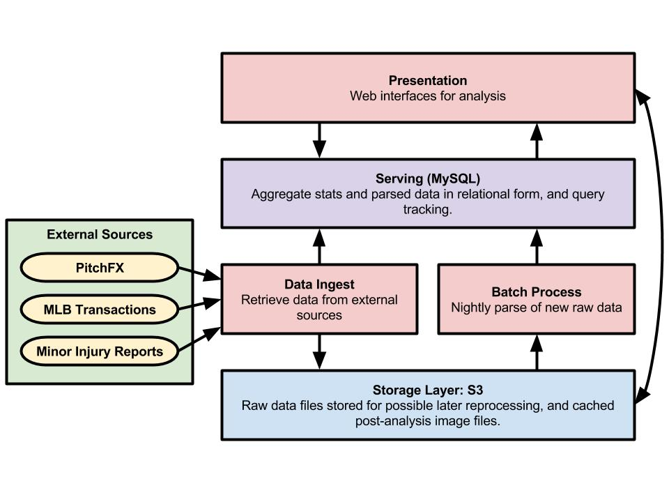
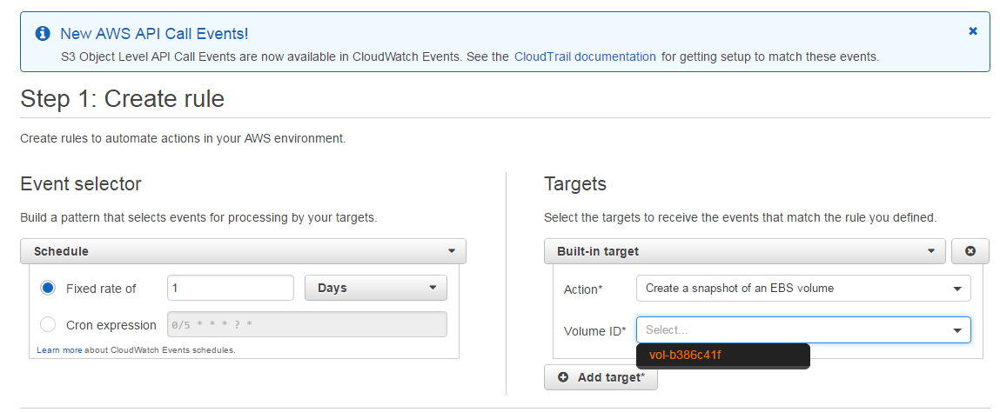

# Architecture

### Presentation Layer - Apache/Flask

#### Justifications

Apache is the de facto open source standard for industrial strength security and performance in serving web pages. Flask allowed us to quickly put together a dynamic web site using the same programming language as our ingestion layer.

#### Limitations

If the site sees high traffic volume, a single Apache instance could become a bottleneck. Future growth may necessitate a reverse proxy such as nginx to distribute traffic across multiple cloned web servers.

### Serving Layer - MySQL

#### Justifications

The py-gameday and py-retrosheet libraries for data ingestion are built with MySQL support. After reviewing our application's needs, we saw no need to re-engineer these scripts to use a different RDBMS.

- Overall data volume is <2GB, which a well-indexed MySQL database can handle easily.
- All user interaction is currently in reads. We are not doing any kind of transaction processing, so high-volume ACID transactions are not needed.
- All writes are performed by nightly batch process, and are relatively low-volume.
- Current aggregations in use do not leverage window functions or other advanced SQL not supported by MySQL.

#### Limitations

Some possible future features may merit a new assessment of storage technology.

- If MLB eventually releases their Statcast data for public consumption, the data volume and aggregation complexity will rise significantly.
- If the application sees wide use, some level of replication may be needed to support query volume.

The ingestion scripts and the presentation layer scripts make use of SQLAlchemy and MySQLdb, which is built on the standard Python database api. A later move to Postgres or some other system would only require fairly trivial code updates.

In case of severe database failure or corruption we take daily snapshots of the EBS drive that the database lives on using [Amazon Cloud Watch](http://docs.aws.amazon.com/AmazonCloudWatch/latest/events/TakeScheduledSnapshot.html). This allows us to bring the database server back up and at most have to import a single day's worth of lost data in the rare instance where the database or EBS volume become corrupted or permanently unavailable.

### Python Ingestion Scripts with Batch Processing

#### Justifications

Python provides several features that made it a good choice for our data ingestion scripts.

- py-gameday and py-retrosheet provide solid, pre-existing libraries for most of our data acquisition.
- The requests and json packages enable easy scraping of MLB.com's JSON APIs.
- Pandas dataframes are a good resource for aggregating at-bat stats.

The incoming data from Gameday and MLB.com are reliably available on a daily basis, so streaming or queueing systems are not needed, and nightly batch processing is sufficient for aggregation.

#### Limitations

This processing method works well for the scale of freely available baseball data. If a high-volume data source like Statcast becomes available, Spark may be integrated using the PySpark libraries. See [Future Scaling](future_scaling.md) for an in-depth discussion about vectors that could increase our ingestion rates as well as strategies to compensate for that additional data flow.

### S3 Datalake

#### Justifications

There are several possible reasons why we might need to return to the raw transaction data for reprocessing. The body part to body area map is a work in progress, and future changes may merit a fresh import, and cases may be found were the current regular expression did not correctly parse the text. In order to account for possible changes in MLB.com's API—reduced availability, format change, request throttling—all imported JSON is stored in S3 prior to processing.

The files are stored in monthly batches (such as 201605.json). At peak transaction time (mid-season), these files reach a bit higher than 1MB. This is small enough to not merit HDFS or other high-volume storage systems.

Possible later uses of S3 include caching frequently-generated graphics.

#### Limitations

S3 is not particularly fast. However, our current use is for overnight batch jobs, rather than dynamic querying, so speed will only be a concern if we add a higher-volume data source later.

[Next > Source Code Guide](source_code.md)  

[Return to Documentation Index](index.md)
