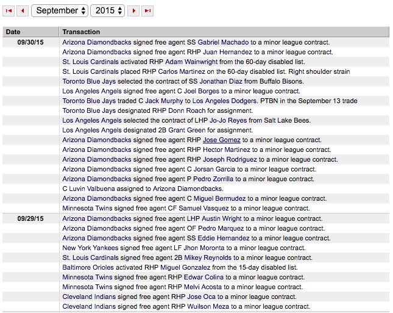
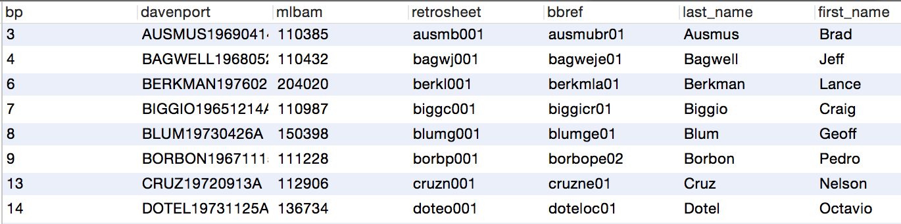

# Datasources

### MLB Transactions
MLB transaction data can be found [here](http://mlb.mlb.com/mlb/transactions/#month=10&year=2016).

The transaction tracker contains details on every roster move made by a major league team. In addition to trades, signings and reassignments, this includes all injury-related moves, including placement on the disabled list, reassignment from the 15-day to the 60-day DL, and activation.



This page is powered by a more flexible JSON API, which provides these additional fields for each transaction:

```json
{
	"trans_date_cd":"D",
	"from_team_id":"",
	"orig_asset":"Player",
	"final_asset_type":"",
	"player":"Casey Sadler",
	"resolution_cd":"FIN",
	"final_asset":"",
	"name_display_first_last":"Casey Sadler",
	"type_cd":"SC",
	"name_sort":"SADLER, CASEY",
	"resolution_date":"2015-09-01T00:00:00",
	"conditional_sw":"",
	"team":"Pittsburgh Pirates",
	"type":"Status Change",
	"name_display_last_first":"Sadler, Casey",
	"transaction_id":"244358",
	"trans_date":"2015-09-01T00:00:00",
	"effective_date":"2015-09-01T00:00:00",
	"player_id":"594987",
	"orig_asset_type":"PL",
	"from_team":"",
	"team_id":"134",
	"note":"Pittsburgh Pirates placed RHP Casey Sadler on the 60-day disabled list. Right forearm strain"
}
```

From this data format we can parse out the relevant injury information. This JSON API is only available as far back as 2009. 2001-2008 are viewable on mlb.com, but are driven by a server-side process. They are also displayed with a grouped structure that makes separating individual injuries from the scraped data problematic. Work on this problem remains ongoing. 

### MLB Gameday
Gameday data can be found [here](http://gd2.mlb.com/components/game/mlb/).  

MLB's Gameday XML drives all the scoreboard and statistical information for MLB.com. It contains data about games, players, play-by-play information, and, using the PitchF/X tracking system, detailed data on every pitch thrown. InjuryFX uses this data for all pitch-granularity analysis, and most at-bat and statistical aggregation.

PitchF/X was implemented league-wide in 2008. Prior to that, some of the Gameday data formatting is inconsistent. For this reason we utilitize other, less-detailed sources for earlier years. 

### Retrosheet
Retrosheet data can be found [here](http://www.retrosheet.org/game.htm)

Retrosheet provides player, game and at-bat data for most games in history. This includes full play-by-play as far back as the 1970s. Because the data goes back further than MLB Gameday, it is useful for at-bat and aggregate information prior to 2008, though it does not provide pitch data.

Because we have only successfully imported the injury data back to 2009, no Retrosheet data is currently being used by the application, but we have developed views to aggregate across a combination of Gameday and Retrosheet, for future use.

### Baseball Heatmaps Player IDs

Baseball Heatmaps provides a spreadsheet mapping various player keys. MLB.com, Retrosheet, Baseball Prospectus and other sites all use different unique id fields for players. This data set is essential for entity resolution as we cross the threshold between Gameday and Retrosheet data, and will be useful as we incorporate any future data sources.



[Return to Documentation Index](index.md)
