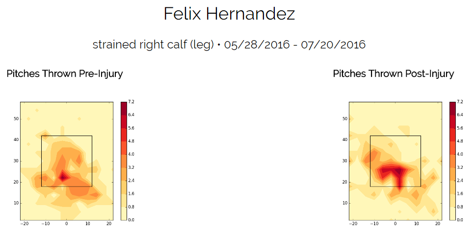
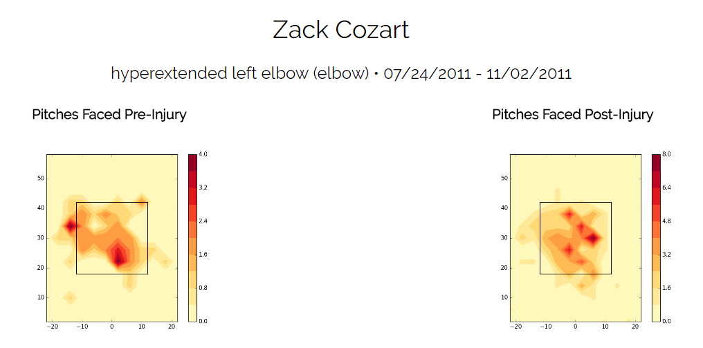
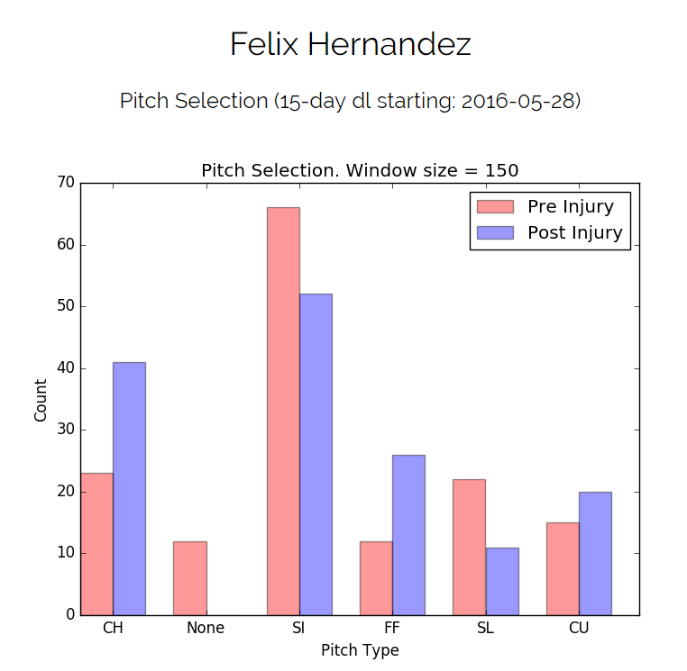

# Sample Tools

There are many tools that could be built on top of our combined data. Here are but a few samples:

### Pitch Heat Map Splits (before and after injury):

### Batter Swing Rates Heat Map Splits (before and after injury):

### Pitch Selection Graphs (before and after injury):

[Return to Documentation Index](index.md)
